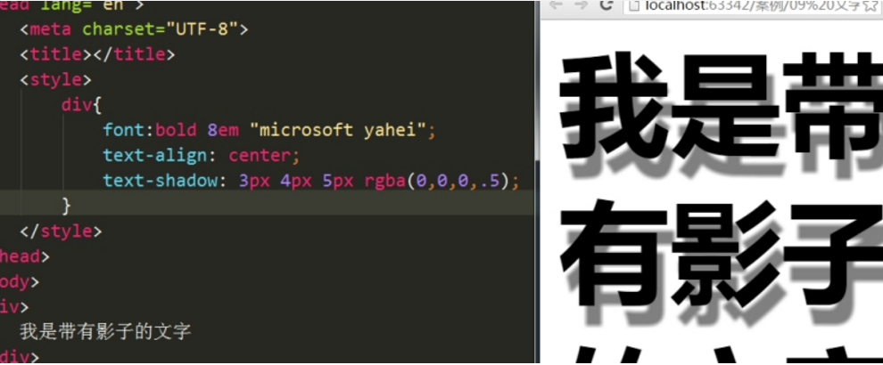
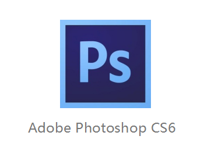
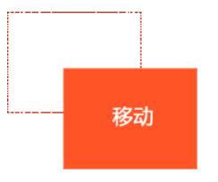
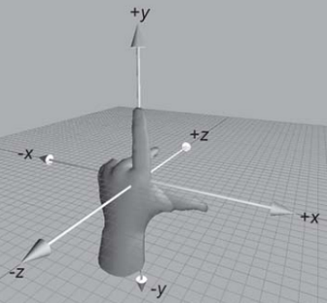
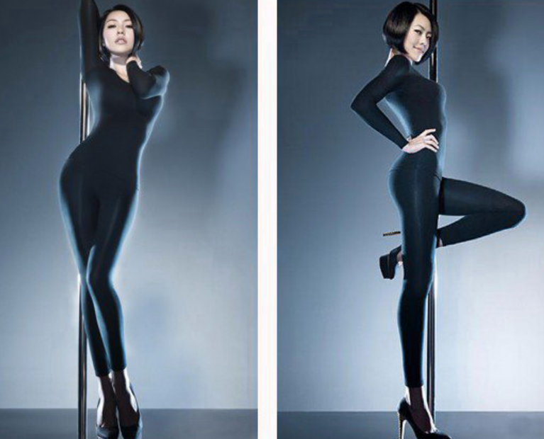

```
# 课程目标:
> 1. 学会使用CSS选择器
> 2. 熟记CSS样式和外观属性
> 3. 熟练掌握CSS各种选择器
> 4. 熟练掌握CSS各种选择器
> 5. 熟练掌握CSS三种显示模式
> 6. 熟练掌握CSS背景属性
> 7. 熟练掌握CSS三大特性
> 8. 熟练掌握CSS盒子模型
> 9. 熟练掌握CSS浮动
> 10.熟练掌握CSS定位
> 11.熟练掌握CSS高级技巧强化CSS
```

#CSS初识

在开始学习CSS之前，我们先从什么是CSS，为什么要使用CSS以及怎样学习CSS三个方面初步认识一下CSS.

## 什么是CSS

CSS全称叫Cascading Style Sheets,层叠样式表，是用来给HTML或XML等文件设置样式的一种计算机语言。它能够对网页中元素位置的排版进行像素级的精确控制，支持几乎所有字体字号样式，拥有对网页对象和模型样式编辑的能力。

随着CSS的不断完善升级，现在最新的CSS版本为3.0版，即CSS3。C3是CSS的技术升级版本，在CSS2的基础上增强或新增了许多特性，弥补了CSS2的众多不足之处，使web开发变得更为高效和便捷。CSS3尤为突出的三个新功能是：**过渡、转换和动画。**


## 为什么要使用CSS

从HTML被发明开始，样式就以各种形式存在，不同的浏览器结合它们各自的样式语言为用户提供页面效果的控制。随着HTML的成长，为了满足页面设计者的要求，HTML添加了很多显示功能。

```html
<table width="400px" height="200px" bgcolor="red"></table>
```

如上示例代码，要显示一个宽为400像素，高为200像素，红色背景的表格，需要个table标签添加很多属性。但是随着样式的增加，HTML变的越来越杂乱，代码也越来越臃肿。

CSS的出现就是为了解决这一问题，将界面结构与显示样式的设置分开，HTML只负责界面结构的搭建，显示样式的设置则交给CSS来完成。

思考：web标准的三个组成部分

## 怎样学习CSS

 CSS的核心在于<font color="red">选择器</font>和<font color="red">属性</font>。**选择器用来说明给哪（几）个元素设置样式，属性用来说明给这（几）个元素具体设置什么样式。**

思考：美食介绍练习

# CSS初体验

我们已经知道了CSS的作用是用来给界面上的元素设置样式，那到底要怎样来给一个元素设置CSS样式呢？

## 行内样式(了解)

行内样式也被称为内联样式，是通过标签的style属性来给元素设置样式。

```html
<p style="font-size:20px">我是p标签里的文字</p>
```

上述示例代码通过给p元素设置style属性，将p元素里的文字字体大小修改成了20像素。

> tips:
>
> 1. style是HTML标签的属性名，它对应的值又是一个键值对。这个键值对中间用冒号 : 连接，它们分别代表**CSS的属性名和属性值**。
> 2. 行内样式是直接添加到HTML标签上的，它并没有将结构层与显示层分开，代码依然很臃肿，所以**不建议大家使用行内样式。**

## 内部样式

内部样式通过在head标签里添加style标签来给指定的元素设置样式。

```html
<head>
  <style type="text/css">
    p {
     	/* 在style标签里通过CSS给元素设置样式 */ 
		font-size:20px;
    }
  </style>
</head>
<body>
  <!-- 在body里，使用HTML搭建界面结构 -->
  <p>我是p里的文字</p>
</body>
```

> tips:
>
> 1. 内部样式在书写时，是在head标签里添加了一个style标签。
> 2. style标签的type="text/css"可以省略不写
> 3. 在style标签里，设置CSS样式时，需要遵守CSS的语法规范。

## 外部样式（外链式）

外链式是指将所有的样式写到一个或者多个.css后缀名的文件里，然后再通过link标签将.css文件链接到HTML文档中。

```html
<head>
  <link rel="stylesheet" type="text/css" href="test.css">
</head>
<body>
  <p>我是p标签里的文字</p>
</body>
```

test.css文件里的内容

```css
p{
    font-size:20px;
}
```

> tips:
>
> 1. link标签需要写在head标签里。
> 2. 需要给link标签设置rel和type属性，而且属性值只能是示例代码里的值。
> 3. href属性用来设置需要链入的文件路径，这个被链入的文件里需要给元素设置样式。

## 三种样式的区别
| 样式表   | 优点           | 缺点           | 使用情况    | 控制范围      |
| ----- | ------------ | ------------ | ------- | --------- |
| 行内样式表 | 书写方便，权重高     | 没有实现样式和结构相分离 | 较少      | 控制一个标签（少） |
| 内部样式表 | 部分结构和样式相分离   | 没有彻底分离       | 较多      | 控制一个页面（中） |
| 外部样式表 | 完全实现结构和样式相分离 | 需要引入         | 最多，强烈推荐 | 控制整个站点（多） |


## CSS规则(重点)

使用HTML时，需要遵从一定的规范。CSS亦如此，要想熟练地使用CSS对网页进行修饰，首先需要了解CSS样式规则，具体格式如下：


> tips:
>
> 1. 选择器用于指定CSS样式作用的HTML对象，花括号内是对该对象设置的具体样式。
> 2. 属性和属性值以“键值对”的形式出现。
> 3. 属性是对指定的对象设置的样式属性，例如字体大小、文本颜色等。
> 4. 属性和属性值之间用英文“:”连接。
> 5. 多个“键值对”之间用英文“;”进行区分。

## CSS注释

和HTML一样，CSS也可以在编码时给代码添加注释。

```html
<head>
  <style>
    p {
        /* 我是css里的注释，我不会被解析 */	
        font-size:20px;
    }
  </style>
</head>
```

# 开发者工具（chrome）

此工具是我们的必备工具，以后代码出了问题，我们首先第一反应就是：

“按F12”或者是 “shift+ctrl+i”   打开 开发者工具。

菜单：   右击网页空白出---查看 


小技巧：

1. ctrl+滚轮 可以 放大开发者工具代码大小。
2. 左边是HTML元素结构   右边是CSS样式。
3. 右边CSS样式可以改动数值和颜色查看更改后效果。

# CSS书写规范

开始就形成良好的书写规范，是你专业化的开始。

## 空格规范

【强制】 选择器 与 { 之间必须包含空格。

示例： .selector { }

【强制】 属性名 与之后的 : 之间不允许包含空格， : 与 属性值 之间必须包含空格。

示例：

font-size: 12px;

## 选择器规范

【强制】 当一个 rule 包含多个 selector 时，每个选择器声明必须独占一行。

示例：

```css
/* good */
.post,
.page,
.comment {
    line-height: 1.5;
}


/* bad */
.post, .page, .comment {
    line-height: 1.5;
}
```

【建议】 选择器的嵌套层级应不大于 3 级，位置靠后的限定条件应尽可能精确。

示例：

```css
/* good */
#username input {}
.comment .avatar {}

/* bad */
.page .header .login #username input {}
.comment div * {}
```

## 属性规范

【强制】 属性定义必须另起一行。

示例：

```css
/* good */
.selector {
    margin: 0;
    padding: 0;
}

/* bad */
.selector { margin: 0; padding: 0; }
```

【强制】 属性定义后必须以分号结尾。

示例：

```css
/* good */
.selector {
    margin: 0;
}

/* bad */
.selector {
    margin: 0
}
```

# CSS选择器(重点、难点)

CSS出现的目的是为了给界面上的元素设置对应的样式，但是如果要想将CSS样式应用于特定的HTML元素，首先就必须要先找到该目标元素。在CSS中，执行这一任务的样式规则部分被称为选择器（选择符）。

## 简单选择器

### 标签选择器

标签选择器是指用HTML标签名称作为选择器，按标签名称分类，为页面中某一类标签指定统一的CSS样式。其基本语法格式如下：

```
标签名{属性1:属性值1; 属性2:属性值2; 属性3:属性值3; }
```

标签选择器最大的优点是能快速为页面中同类型的标签统一样式，同时这也是他的缺点，不能设计差异化样式。

### 类选择器

类选择器使用“.”（英文点号）进行标识，后面紧跟类名，其基本语法格式如下：

```html
<head>
  <style>
    .big{  /* 在CSS里通过 .类名的形式给元素设置样式 */
    	font-size:20px;
  	}
  </style>
</head>
<body>
  <!-- 在HTML结构里，给p标签添加class属性 -->
  <p class="big">我是p标签里的文字</p>
</body>
```

> tips:
>
> 1. 不要使用纯数字或则中文命名。
>
> 2. 长名称或词组可以使用中横线来命名选择器，如big-text
>
> 3. 不建议使用"_"来命名。原因：
>
>    a. 输入时少按一个shift键
>
>    b. 浏览器的兼容性问题(比如使用_tips的选择器命名，在IE6是无效的)
>
>    c. 能良好的区分JavaScript的变量名(JS变量名必须使用"_")

课堂练习：谷歌logo


### id选择器

id选择器使用“#”进行标识，后面紧跟id名，其基本语法格式如下：

```html
<head>
	<style>
      #big-p{ /* 使用id选择器，需要在前面添加 # */
          font-size:20px;
      }
  	</style>
</head>
<body>
  <p id="big-p">我是p标签里的文字</p>
</body>
```

用法基本和类选择器相同。

思考：id选择器和类选择器的区别。

### 通配符选择器

通配符选择器用“*”号表示，他是所有选择器中作用范围最广的，能匹配页面中所有的元素。其基本语法格式如下：

```html
<head>
  <style>
    *{   /* 通配符选择器指的是设置界面上所有的元素 */
    font-size:20px;
  }
  </style>
</head>
<body>
  <p>我是p标签里的文字</p>
  <span>我是span里的文字</span>
  <div>我是div里的文字</div>
</body>
```

由于通配符选择器会将界面上所有的元素都设置一次样式，如果界面上的HTML元素越多，通配符选择器的效率也就越低，所以，最好不要在通配符选择器里设置大量的样式。

一般情况下，我们会使用下面这段代码，通过通配符选择器清除所有HTML元素的默认边距。

```css
* {
  margin: 0;                    /* 取消所有元素默认外边距*/
  padding: 0;                   /* 取消所有元素默认内边距*/
}
```

## 伪类选择器

 伪类选择器用于向某些选择器添加特殊的效果。比如给链接添加特殊效果， 比如可以选择 第1个，第n个元素。

```css
类选择器是一个点 比如 .demo {}   而我们的伪类 用 2个点 就是 冒号  比如  :link{}
```

CSS中提供的伪类选择器非常非常多，我们只给大家介绍一些最常用的伪类选择器。

更多伪类选择器请参考[MDN伪类选择器](https://developer.mozilla.org/zh-CN/docs/Web/CSS/Pseudo-classes)

### 锚伪类选择器

- :link      /* 未访问的链接 */
- :visited   /* 已访问的链接 */
- :hover     /* 鼠标移动到链接上 */
- :active    /* 选定的链接 */

   注意写的时候，他们的顺序不能够颠倒，否则在显示时有可能会出现问题。

```css
a {   /* a是标签选择器  所有的链接 */
	font-weight: 700;
	font-size: 16px;
}
a:link { /* :link 是指未被访问过的链接 */
    color:yellow;
}
a:visited { /* :visited 是指已经被访问过的链接 */
    color:blue;
}
a:hover {   /* :hover 是链接伪类选择器 鼠标经过 */
	color: red; /*  鼠标经过的时候，由原来的 灰色 变成了红色 */
}
a:active {  /* :active 是指当鼠标按下状态的链接 */
    color:pink; 
}
```

### 目标伪类选择器

:target目标伪类选择器 :选择器可用于选取当前活动的目标元素

```css
:target {
	font-size:30px;
  	color:red;
}
```

### 结构伪类选择器

- :first-child :选取属于其父元素的首个子元素的指定选择器

- :last-child :选取属于其父元素的最后一个子元素的指定选择器

- :nth-child(n) ： 匹配属于其父元素的第 N 个子元素，不论元素的类型

- :nth-last-child(n) ：选择器匹配属于其元素的第 N 个子元素的每个元素，不论元素的类型，从最后一个子元素开始计数。

  n 可以是数字、关键词或公式

```css
li:first-child { /*  选择第一个孩子 */
    color: pink; 
}
li:nth-child(4) {   /* 选择第4个孩子  n  代表 第几个的意思 */ 
    color: skyblue;
}
li:nth-child(2n){ /* 序号为偶数的子元素 */
    color:yellow;
}
li:nth-child(odd){  /* 序号为奇数的子元素 */
    color:pink;
}
li:last-child {   /* 最后一个孩子 */
    color: purple;
}
li:nt-last-child(2){  /* 倒数第二个孩子 */
    color:red;
}
```

扩展：first-of-type伪类选择器。

## 伪元素选择器

1. E::first-letter文本的第一个单词或字（如中文、日文、韩文等）
2. E::first-line 文本第一行；
3. E::selection 可改变选中文本的样式；

```css
p::first-letter {
  font-size: 20px;
  color: hotpink;
}

/* 首行特殊样式 */
p::first-line {
  color: skyblue;
}

p::selection {
  /* font-size: 50px; */
  color: orange;
}
```

4、E::before和E::after

在E元素内部的开始位置和结束位创建一个元素，该元素为行内元素，且必须要结合content属性使用。

```css
div::befor {
  content:"开始";
}
div::after {
  content:"结束";
}
```

E:after、E:before 在旧版本里是伪元素，CSS3的规范里“:”用来表示伪类，“::”用来表示伪元素，但是在高版本浏览器下E:after、E:before会被自动识别为E::after、E::before，这样做的目的是用来做兼容处理。

E:after、E:before后面的练习中会反复用到，目前只需要有个大致了解

":" 与 "::" 区别在于区分伪类和伪元素

思考：伪元素的本质

## 复合选择器

### 后代选择器(重点)

后代选择器又称为包含选择器，用来选择元素的后代，其写法就是把外层标签写在前面，内层标签写在后面，中间用空格分隔。

```html
<head>
  <style>
    .father p{
      	/* 类名为father的元素，它的所有子元素p字体都变成20像素 */	
        font-size:20px;
    }
  </style>
</head>
<body>
  <div class="father">
    <p>我是father里的p.我会变大吗？</p>
    <span>我是father里的span.我会变大吗？</span>
    <div class="son">
      <p>我是father里，son元素下的p.我会变大吗？</p>
    </div>
  </div>
  <div class="uncle">
  	<p>我是uncle里的p.我会变大吗？</p>
  </div>
</body>
```

### 子元素选择器

子元素选择器只能选择作为某元素子元素的元素。其写法就是把父级标签写在前面，子级标签写在后面，中间跟一个 &gt; 进行连接。

```html
<head>
  <style>
    .father > p{
      	/* 类名为father的元素，它的直接子元素p字体变成20像素 */	
        font-size:20px;
    }
  </style>
</head>
<body>
  <div class="father">
    <p>我是father里的p.我会变大吗？</p>
    <span>我是father里的span.我会变大吗？</span>
    <div class="son">
      <p>我是father里，son元素下的p.我会变大吗？</p>
    </div>
  </div>
  <div class="uncle">
  	<p>我是uncle里的p.我会变大吗？</p>
  </div>
</body>
```

> tips:
>
> 子元素选择器只包含直接子元素，也就是说孙子、重孙子等都不包含。

### 并集选择器

并集选择器（CSS选择器分组）是各个选择器通过<strong style="color:#f00">逗号</strong>连接而成的，任何形式的选择器（包括标签选择器、class类选择器id选择器等），都可以作为并集选择器的一部分。如果某些选择器定义的样式完全相同，或部分相同，就可以利用并集选择器为它们定义相同的CSS样式。

```html
<head>
  <style>
    p,.first-div{
        font-size:20px;
    }
  </style>
</head>
<body>
  <p>我是p标签里的文字</p>
  <span>我是span标签里的文字</span>
  <div class="first-div">我是第一个div标签里的文字</div>
  <div>我是第二个div标签里的文字</div>
</body>
```

并集选择器就是和的意思。上述示例代码里的选择器可以理解为：标签名为p的元素，和类名为first-div的元素，字体大小都设置为20像素。

### 交集选择器

交集选择器由两个选择器构成，其中第一个为标签选择器，第二个为class选择器，两个选择器之间<strong style="color:#f00">不能有空格</strong>

```html
<head>
  <style>
    p.big-text{ /* 既是p标签，同时类名又是big-text的元素 */
        font-size:20px;
    }
  </style>
</head>
<body>
  <p class="big-text">我是p标签里的文字</p>
  <p>我也是p标签里的文字</p>
  <div class="big-text">我是div标签里的文字</div>
</body>
```

交集选择器就是并且的意思。上述示例代码的选择器只能匹配到第一个p标签，因为只有它才满足既是p标签，而且类名又是big-text的条件。

### 属性选择器

选取标签带有某些特殊属性的选择器 我们成为属性选择器。

```css
<head>
  <style>
    a[href]{ /* 所有设置了href属性的a标签 */
      font-size: 20px;
    }
    a[href="http://www.baidu.com"]{ /* 所有href属性值等于 http://www.baidu.com 的a标签 */
      color: yellowgreen;
    }
    div[class ^= "first"]{ /* 所有class属性值以first开头的div */
      color: greenyellow;
    }
    div[class $= "xxx"]{ /* 所有class属性值以 xxx 结尾的div */
      font-size: 30px;
    }
    div[class *= "xxx"]{/* 所有class属性包含 xxx 的div */
      text-decoration: underline;
    }
  </style>
</head>
<body>
  <a href="#">a链接</a>
  <a href="http://www.baidu.com">百度</a>
  <div class="first-xxx">我是第一个div</div>
  <div class="second-xxx">我是第二个div</div>
</body>
```

属性选择器的更多规范，请参考:[MDN属性选择器](https://developer.mozilla.org/zh-CN/docs/Web/CSS/Attribute_selectors)

## 总结

选择器是CSS里最重要的部分之一，想要给元素设置样式，首先就要通过选择器找到这个元素。CSS给我们提供了大量的选择器使用，我们在实际开发中需要根据自己的需求来选取合适的选择器。

更多选择器，请参考[MDN选择器](https://developer.mozilla.org/zh-CN/docs/Learn/CSS/Introduction_to_CSS/Selectors)或[W3School选择器](http://www.w3school.com.cn/cssref/css_selectors.asp)

# CSS的三大特性

## 层叠性

所谓层叠性是指多种CSS样式的叠加。

是浏览器处理冲突的一个能力,如果一个属性通过两个相同选择器设置到同一个元素上，那么这个时候一个属性就会将另一个属性层叠掉

比如先给某个标签指定了内部文字颜色为红色，接着又指定了颜色为蓝色，此时出现一个标签指定了相同样式不同值的情况，这就是样式冲突。

1. 样式冲突，需要计算样式的优先级，优先级高的样式起作用。
2. 样式不冲突，不会层叠

```
CSS最后的执行口诀：  长江后浪推前浪，前浪死在沙滩上。
```

## 继承

所谓继承性是指书写CSS样式表时，子标签会继承父标签的某些样式，如文本颜色和字号。想要设置一个可继承的属性，只需将它应用于父元素即可。

简单的理解就是：  子承父业。

> 恰当地使用继承可以简化代码，降低CSS样式的复杂性。子元素可以继承父元素的样式（text-，font-，line-这些元素开头的都可以继承，以及color属性）

## 优先级

定义CSS样式时，经常出现两个或更多规则应用在同一元素上，这时就会出现优先级的问题。

> tips:
>
> 1. 继承样式的权重为0。即在嵌套结构中，不管父元素样式的权重多大，被子元素继承时，他的权重都为0，也就是说子元素定义的样式会覆盖继承来的样式。
> 2. 行内样式优先。应用style属性的元素，其行内样式的权重非常高，可以理解为远大于100。总之，他拥有比上面提高的选择器都大的优先级。
> 3. **权重相同时，CSS遵循就近原则。**也就是说靠近元素的样式具有最大的优先级，或者说排在最后的样式优先级最大。
> 4. CSS定义了一个!important命令，被!important修饰的属性拥有最高优先级。

简单选择器的默认优先级排序是：

```
!important > 行内样式 > id选择器 > 类选择器(或者属性、伪类选择器) > 标签选择器 > 通配符选择器 > 浏览器默认样式 > 继承
```

### CSS特殊性（Specificity）

关于CSS权重，我们需要一套计算公式来去计算，这个就是 CSS Specificity，我们称为CSS 特性或称非凡性，它是一个衡量CSS值优先级的一个标准 具体规范入如下：

specificity用一个四位的数 字串(CSS2是三位)来表示，更像四个级别，值从左到右，左面的最大，一级大于一级，数位之间没有进制，级别之间不可超越。 

| 继承或者* 的贡献值      | 0,0,0,0 |
| --------------- | ------- |
| 每个元素（标签）贡献值为    | 0,0,0,1 |
| 每个类，伪类贡献值为      | 0,0,1,0 |
| 每个ID贡献值为        | 0,1,0,0 |
| 每个行内样式贡献值       | 1,0,0,0 |
| 每个!important贡献值 | ∞ 无穷大   |

权重是可以叠加的。比如的例子：

```
div ul  li   ------>      0,0,0,3

.nav ul li   ------>      0,0,1,2

a:hover      -----—>      0,0,1,1

.nav a       ------>      0,0,1,1   

#nav p       ----->       0,1,0,1
```

```
权重是优先级的算法，层叠是优先级的表现。
在比较优先级时，如果有被important修饰的样式，它的优先级最高；如果有行内样式，行内样式的优先级要大于所有其他选择器的优先级；如果既没有important又没有行内样式，则需要对优先级进行计算，计算的规则如下：
先比较id选择器的个数，再比较类选择器的个数，然后比较标签选择器的个数。
```

课堂练习：CSS优先级精华6题

# CSS字体相关属性

在页面布局中，我们经常需要给页面上的文字指定字体、字号和字体样式等。使用CSS字体相关的属性可以很方便的完成字体的设置。

## font-size:字号大小

font-size属性用于设置字号，该属性的值可以使用关键字，也可以设置具体的值。

| 值                                        | 含义                                       |
| ---------------------------------------- | ---------------------------------------- |
| xx-small<br>x-small<br>small<br>medium<br>large<br>x-large<br>xx-large | 把字体的尺寸设置为不同的尺寸，从 xx-small 到 xx-large。默认值：medium。 |
| smaller                                  | 把 font-size 设置为比父元素更小的尺寸。                |
| larger                                   | 把 font-size 设置为比父元素更大的尺寸。                |
| *length*                                 | 把 font-size 设置为一个固定的值。                   |
| *%*                                      | 把 font-size 设置为基于父元素的一个百分比值。             |

## font-family:字体

font-family属性用于设置字体。网页中常用的字体有宋体、微软雅黑、黑体等，例如将网页中所有段落文本的字体设置为微软雅黑，可以使用如下CSS样式代码：

```css
p{ font-family:"微软雅黑","宋体";}
```

可以同时指定多个字体，中间以逗号隔开，表示如果浏览器不支持第一个字体，则会尝试下一个，直到找到合适的字体。

> 常用技巧：

```
1. 现在网页中普遍使用14px+。
2. 尽量使用偶数的数字字号。ie6等老式浏览器支持奇数会有bug。
3. 各种字体之间必须使用英文状态下的逗号隔开。
4. 中文字体需要加英文状态下的引号，英文字体一般不需要加引号。当需要设置英文字体时，英文字体名必须位于中文字体名之前。
5. 如果字体名中包含空格、#、$等符号，则该字体必须加英文状态下的单引号或双引号，例如font-family: "Times New Roman";。
6. 尽量使用系统默认字体，保证在任何用户的浏览器中都能正确显示。
```

### Unicode字体

在 CSS 中设置字体名称，直接写中文是可以的。但是在文件编码（GB2312、UTF-8 等）不匹配时会产生乱码的错误。xp 系统不支持 类似微软雅黑的中文。

方案一： 你可以使用英文来替代。 比如 font-family:"Microsoft Yahei"。

方案二： 在 CSS 直接使用 Unicode 编码来写字体名称可以避免这些错误。使用 Unicode 写中文字体名称，浏览器是可以正确的解析的。
font-family: "\5FAE\8F6F\96C5\9ED1"，表示设置字体为“微软雅黑”。

为了照顾不同电脑的字体安装问题，我们尽量只使用宋体和微软雅黑中文字体


部分字体对应的英文名称及Unicode编码如下：

| 字体名称      | 英文名称            | Unicode 编码           |
| --------- | --------------- | -------------------- |
| 宋体        | SimSun          | \5B8B\4F53           |
| 新宋体       | NSimSun         | \65B0\5B8B\4F53      |
| 黑体        | SimHei          | \9ED1\4F53           |
| 微软雅黑      | Microsoft YaHei | \5FAE\8F6F\96C5\9ED1 |
| 楷体_GB2312 | KaiTi_GB2312    | \6977\4F53_GB2312    |
| 隶书        | LiSu            | \96B6\4E66           |
| 幼园        | YouYuan         | \5E7C\5706           |
| 华文细黑      | STXihei         | \534E\6587\7EC6\9ED1 |
| 细明体       | MingLiU         | \7EC6\660E\4F53      |
| 新细明体      | PMingLiU        | \65B0\7EC6\660E\4F53 |

## font-weight:字体粗细

字体加粗除了用 b  和 strong 标签之外，可以使用CSS 来实现。

```html
font-weight属性用于定义字体的粗细，其可用属性值：normal、bold、bolder、lighter、100~900（100的整数倍）。
```

小技巧： 

```css
数字 400 等价于 normal，而 700 等价于 bold。  但是我们更喜欢用数字来表示。  
```

## font-style:字体风格

字体倾斜除了用 i  和 em 标签之外，可以使用CSS 来实现，但是CSS 是没有语义的。

font-style属性用于定义字体风格，如设置斜体、倾斜或正常字体，其可用属性值如下：

normal：默认值，浏览器会显示标准的字体样式。

italic：浏览器会显示斜体的字体样式。

oblique：浏览器会显示倾斜的字体样式。

小技巧： 

```
平时我们很少给文字加斜体，反而喜欢给斜体标签（em，i）改为普通模式。
```

## font:综合设置字体样式 (重点)

font属性用于对字体样式进行综合设置，其基本语法格式如下：

```css
选择器{font: font-style  font-weight  font-size/line-height  font-family;}
```

> 注意：其中不需要设置的属性可以省略不写（取默认值），但<font color="red">必须要</font>设置**font-size和font-family**属性，而且font-size和font-family必须要写在最后，且顺序不能修改。

课堂练习：体育新闻案例

# CSS外观属性

## color:文本颜色

color属性用于定义文本的颜色，其取值方式有如下3种：

1.预定义的颜色值，如red，green，blue等。

2.十六进制，如#FF0000,#29D794等。实际工作中，十六进制是最常用的定义颜色的方式。十六进制的颜色在部分情况下可以进行简写，比如:#FF0000可以简写成为#F00,#FF00FF可以简写成为#F0F.

3.RGB代码，如红色可以表示为rgb(255,0,0)或rgb(100%,0%,0%)。

4.RGBA代码，如rgba(255,0,0,.5)就表示一个半透明的红色。

需要注意的是，如果使用RGB代码的百分比颜色值，取值为0时也不能省略百分号，必须写为0%。

## line-height:行间距

ine-height属性用于设置行间距，就是行与行之间的距离，即字符的垂直间距，一般称为行高。line-height常用的属性值单位有三种，分别为像素px，相对值em和百分比%，实际工作中使用最多的是像素px

一般情况下，行距比字号大7.8像素左右就可以了。

## text-align:水平对齐方式

```
text-align属性用于设置文本内容的水平对齐，相当于html中的align对齐属性。其可用属性值如下：
```

left：左对齐（默认值）

right：右对齐

center：居中对齐

## text-indent:首行缩进

text-indent属性用于设置首行文本的缩进，其属性值可为不同单位的数值、em字符宽度的倍数、或相对于父元素宽度的百分比%，允许使用负值, 建议使用em作为设置单位。

1em 就是一个字的宽度   如果是汉字的段落， 1em 就是一个汉字的宽度

## text-decoration:文本装饰

text-decoration   通常我们用于给链接修改装饰效果

| 值            | 描述                      |
| ------------ | ----------------------- |
| none         | 默认。定义标准的文本。             |
| underline    | 定义文本下的一条线。下划线 也是我们链接自带的 |
| overline     | 定义文本上的一条线。              |
| line-through | 定义穿过文本下的一条线。            |

## letter-spacing:字间距

letter-spacing属性用于定义字间距，所谓字间距就是字符与字符之间的空白。其属性值可为不同单位的数值，允许使用负值，默认为normal。

## word-spacing:单词间距

word-spacing属性用于定义英文单词之间的间距，对中文字符无效。和letter-spacing一样，其属性值可为不同单位的数值，允许使用负值，默认为normal。

word-spacing和letter-spacing均可对英文进行设置。不同的是letter-spacing定义的为字母之间的间距，而word-spacing定义的为英文单词之间的间距。

## 文字阴影(CSS3)

以后我们可以给我们的文字添加阴影效果了  Shadow  影子  

```css
text-shadow:水平位置 垂直位置 模糊距离 阴影颜色;
```

 前两项是必须写的。  后两项可以选写。




> tips:
>
> 可以给一个文字设置多个阴影效果，中间使用逗号 "," 进行连接。

课堂练习：显示一个凹凸的文字。


# CSS背景属性

CSS 可以添加背景颜色和背景图片，以及来进行图片设置。

| background-color                      | 背景颜色     |
| ------------------------------------- | -------- |
| background-image                      | 背景图片地址   |
| background-repeat                     | 是否平铺     |
| background-position                   | 背景位置     |
| background-attachment                 | 背景固定还是滚动 |
| 背景的合写（复合属性）                           |          |
| background:背景颜色 背景图片地址 背景平铺 背景滚动 背景位置 |          |

## 背景颜色(color)

语法：

```css
background-color: red | #f00 | rgb(255,0,0) |rgba(255,0,0,.8);
```

## 背景图片(image)

语法： 

```css
background-image : none | url (url) 
```

参数： 

none : 　无背景图（默认的）
url : 　使用绝对或相对地址指定背景图像 

background-image 属性允许指定一个图片展示在背景中（只有CSS3才可以多背景）可以和 background-color 连用。 如果图片不重复地话，图片覆盖不到地地方都会被背景色填充。 如果有背景图片平铺，则会覆盖背景颜色。

小技巧：  我们提倡 背景图片后面的地址，url不要加引号


## 背景平铺（repeat）

语法： 

```css
background-repeat : repeat | no-repeat | repeat-x | repeat-y 
```

参数： 

repeat : 　背景图像在纵向和横向上平铺（默认的）

no-repeat : 　背景图像不平铺

repeat-x : 　背景图像在横向上平铺

repeat-y : 　背景图像在纵向平铺 

## 背景位置(position)

语法： 

```css
background-position : length || length

background-position : position || position 
```

参数： 

length : 　百分数 | 由浮点数字和单位标识符组成的长度值。请参阅长度单位 
position : 　top | center | bottom | left | center | right 

说明： 

设置或检索对象的背景图像位置。必须先指定background-image属性。默认值为：(0% 0%)。
如果只指定了一个值，该值将用于横坐标。纵坐标将默认为50%。第二个值将用于纵坐标。

注意：

1. position 后面是x坐标和y坐标。 可以使用方位名词或者 精确单位。
2. 如果和精确单位和方位名字混合使用，则必须是x坐标在前，y坐标后面。比如 background-position: 15px top;   则 15px 一定是  x坐标   top是 y坐标。

实际工作用的最多的，就是背景图片居中对齐了。

## 背景附着

语法： 

```css
background-attachment : scroll | fixed 
```

参数： 

scroll : 　背景图像是随对象内容滚动
fixed : 　背景图像固定 

说明： 设置或检索背景图像是随对象内容滚动还是固定的。

## 背景简写

background属性的值的书写顺序官方并没有强制标准的。为了可读性，建议大家如下写：

background:背景颜色 背景图片地址 背景平铺 背景滚动 背景位置

```css
background: transparent url(image.jpg) repeat-y  scroll 50% 0 ;
```

课堂练习：购物车案例、五彩导航案例

## 背景缩放(CSS3)

通过background-size设置背景图片的尺寸，就像我们设置img的尺寸一样，在移动Web开发中做屏幕适配应用非常广泛。

其参数设置如下：

a) 可以设置长度单位(px)或百分比（设置百分比时，参照盒子的宽高）

b) 设置为cover时，会自动调整缩放比例，保证图片始终填充满背景区域，如有溢出部分则会被隐藏。我们平时用的cover 最多

c) 设置为contain会自动调整缩放比例，保证图片始终完整显示在背景区域。

```css
background-image: url('images/gyt.jpg');
			background-size: 300px 100px;
			/* background-size: contain; */
			/* background-size: cover; */
```

## 多背景(CSS3)

以逗号分隔可以设置多背景，可用于自适应布局  做法就是 用逗号隔开就好了。

- 一个元素可以设置多重背景图像。 
- 每组属性间使用逗号分隔。 
- 如果设置的多重背景图之间存在着交集（即存在着重叠关系），前面的背景图会覆盖在后面的背景图之上。
- 为了避免背景色将图像盖住，背景色通常都定义在最后一组上，

```css
background:url(test1.jpg) no-repeat scroll 10px 20px/50px 60px  ,
	   url(test1.jpg) no-repeat scroll 10px 20px/70px 90px ,
	   url(test1.jpg) no-repeat scroll 10px 20px/110px 130px  #aaa;
```

## 渐变背景（CSS3）

在给一个元素设置**background-image**属性时，不仅可以通过url指定一张图片，还可以通过线性渐变(linear-gradient)或者径向渐变(radial-gradient)设置一张颜色渐变的背景图。

### 线性渐变


```css
div{ 
	/* 设置从左到右颜色由黄渐变为绿 */
	background-image: linear-gradient(to right,yellow,green);
}
```


### 径向渐变


```css
div{ 
	/* 设置从中间到四周颜色由黄渐变为绿 */
	background-image: radial-gradient(to right,yellow,green);
}
```


# 元素的显示方式

通过之前的学习，大家应该已经感觉到了，不同的标签显示的效果是不同的。例如，a标签、span等标签，他们在界面上显示时，宽度是由内容决定的；而对于h系列标签、div等标签，他们的宽度却是父元素的宽度。一个标签在浏览器上显示时，它的显示方式是由display属性决定的。

## 块级元素(block-level)

每个块元素通常都会独自占据一整行或多整行，可以对其设置宽度、高度、对齐等属性，常用于网页布局和网页结构的搭建。

```
常见的块元素有<h1>~<h6>、<p>、<div>、<ul>、<ol>、<li>等，其中<div>标签是最典型的块元素。
```

块级元素的特点：

（1）总是从新行开始（每个元素独占一行）

（2）高度，行高、外边距以及内边距都可以控制。

（3）宽度默认是容器（父元素）的100%

（4）可以容纳内联元素和其他块元素。

## 行内元素(inline-level)

行内元素（内联元素）不占有独立的区域，仅仅靠自身的字体大小和图像尺寸来支撑结构，一般不可以设置宽度、高度、对齐等属性，常用于控制页面中文本的样式。

```
常见的行内元素有<a>、<strong>、<b>、<em>、<i>、<del>、<s>、<ins>、<u>、<span>等，其中<span>标签最典型的行内元素。
```

行内元素的特点：

（1）和相邻行内元素在一行上（不独占一行）。

（2）高、宽无效，但水平方向的padding和margin可以设置，垂直方向的无效。

（3）默认宽度就是它本身内容的宽度。

（4）行内元素只能容纳文本或者其他行内元素。（a特殊）

      注意：  

1. 只有 文字才 能组成段落  因此 p  里面不能放块级元素，同理还有这些标签h1,h2,h3,h4,h5,h6,dt，他们都是文字类块级标签，里面不能放其他块级元素。
2. 链接里面不能再放链接。

## 行内块元素（inline-block）

```
在行内元素中有几个特殊的标签——、<input />、<td>，可以对它们设置宽高和对齐属性，有些资料可能会称它们为行内块元素。

行内块元素的特点：
（1）和相邻行内元素（行内块）在一行上,但是之间会有空白缝隙。
（2）默认宽度就是它本身内容的宽度。
（3）高度，行高、外边距以及内边距都可以控制。
```

## 标签显示模式转换 display

块转行内：display:inline;

行内转块：display:block;

块、行内元素转换为行内块： display: inline-block;

此阶段，我们只需关心这三个，其他的是我们后面的工作。

课堂练习：英雄联盟导航栏

# 盒子模型（重点）

其实，CSS就三个大模块：  盒子模型 、 浮动 、 定位，其余的都是细节。要求这三部分，无论如何也要学的非常精通。  

所谓盒子模型就是把HTML页面中的元素看作是一个矩形的盒子，也就是一个盛装内容的容器。每个矩形都由元素的内容、内边距（padding）、边框（border）和外边距（margin）组成。

## 看透网页布局的本质

网页布局中，我们是如何把里面的文字，图片，按照美工给我们的效果图排列的整齐有序呢？

我们说过，行内元素比如 文字 图片等，需要一个个盒子把他们装起来，我们前面学过的标签都可以看做是一个盒子。有了盒子，我们就可以随意的，自由的，摆放位置了。

 把网页元素比如文字图片等等，放入盒子里面，然后利用CSS摆放盒子的过程，就是网页布局。


## 盒子模型概念

首先，我们来看一张图，来体会下什么是盒子模型。


所有的文档元素（标签）都会生成一个矩形框，我们成为元素框（element box），它描述了一个文档元素再网页布局汇总所占的位置大小。因此，<strong style="color: #f00;">每个盒子除了有自己大小和位置外，还影响着其他盒子的大小和位置。</strong>


HTML里的盒子模型由以下四部分组成：**边框、内边距、外边距和内容**。

## 盒子边框（border）

语法： 

```css
border : border-width || border-style || border-color 
```

### 边框样式

样式是边框最重要的一个方面，这不是因为样式控制着边框的显示，而是因为**如果没有样式，将根本没有边框**。

我们可以给边框设置统一的样式，同时还可以给四周的边框按照上右下左的顺序分别指定不同的样式。

```css
border-style:solid;   /* 设置上下左右的边框样式都为实线 */

border-style:solid dotted; /* 设置上下边框的样式为实线，左右边框的样式为点 */

border-top-style: solid; /* 设置上边框的样式 */

border-right-style: dotted;  /* 设置右边框的样式 */

border-bottom-style: dashed;  /* 设置下边框的样式 */

border-left-style: double;    /* 设置左边框的样式 */
```


### 边框宽度

可以通过设置border-width属性来设置线宽。但是需要注意：border-width只有在border-style值不为none时，才有效。也就是说，如果要设置线宽，必须要先修改border-style.

border-width: 10px;

border-style: solid;  /* 必须要设置border-style为非none才能够看到线宽 */

除了可以给边框设置统一的线宽以外，我们还可以按照上右下左的顺序给边框的四边设置不同的线宽，其用法和设置border-style类似。

### 边框颜色

设置边框的颜色。

```
border-color:red;
```

除了可以给边框设置统一的颜色，我们还可以按照上右下左的顺序给边框的四边设置不同的颜色，用法和设置border-style类似。

### 边框属性连写

```css
border : border-width || border-style || border-color 
```

课堂练习：使用边框切三角形

### 边框图片（了解）

注意：设置border-image并不会改变盒子的大小。

```css
div {
  background-color: pink;
  width: 400px;
  height: 400px;
}
div:first-child {
  /*使用border-image属性必须要设置border属性,指定线宽和样式 */
  border: 27px solid #000;
  /* 设置边框图片的路径 */
  border-image-source: url(border01.png);
  /* 设置边框图片的分隔方式。图片是81px,分成九份，每份的宽高都是27px */
  border-image-slice: 27;
  /* 
    设置中间图片的重复方式。
    stretch:默认值，即中间部分图片以拉伸的方式进行填充;
    repeat:中间部分的图片以重复的方式填充,在某些情况下，会出现半张图片的情况;
    round:中间部分的图上以重复的方式填充,如果有多的空间，会平均分配;
  */
  border-image-repeat: round;
  /* 边框图片的宽度 */
  border-image-width: 40px;
  /* 设置边框图片与盒子的间距 */
  border-image-outset: 20px;
}
div:nth-child(2){
  border: 20px solid #000;
  border-image-source: url(border02.png);
  border-image-slice: 20;
  border-image-repeat: round;
}
```

### 圆角边框(CSS3)

用来设置盒子的圆角边框，可以给定一到四个值。

```css
border-radius:10px; /* 四个角的边框圆角都是10px */

/* 从左上角开始，顺时针方向的圆角边框分别是10px,15px,10px,15px */
border-radius:10px 15px;

/* 从左上角开始，顺时针方向的圆角边框分别是10px,15px,20px,15px */
border-radius:10px 15px 20px;

/* 从左上角开始，顺时针方向的圆角边框分别是10px,15px,20px,25px */
border-radius:10px 15px 20px 25px;

/* 在四个角上画一个椭圆，它的水平半径是20px,垂直半径是60px */
border-radius:20px/60px;
```

### 表格的边框

以前学过的html表格边框很粗，这里只需要CSS一句话就可以美观起来。 

table{ border-collapse:collapse; }  collapse 单词是合并的意思

border-collapse:collapse; 表示边框合并在一起。

课堂练习：小说排行版

## 内边距（padding）

padding属性用于设置内边距。  是指 边框与内容之间的距离。

 注意：  后面跟几个数值表示的意思是不一样的。

| 值的个数 | 表达意思                                     |
| ---- | ---------------------------------------- |
| 1个值  | padding：上下左右边距 比如padding: 3px; 表示上下左右都是3像素 |
| 2个值  | padding: 上下边距 左右边距 比如 padding: 3px 5px; 表示 上下3像素 左右 5像素 |
| 3个值  | padding：上边距 左右边距 下边距 比如 padding: 3px 5px 10px; 表示 上是3像素 左右是5像素 下是10像素 |
| 4个值  | padding:上内边距 右内边距 下内边距 左内边距 比如: padding: 3px 5px 10px 15px; 表示 上3px 右是5px 下 10px 左15px 顺时针 |

内边距特点：

```
1. padding是盒子内的一部分，修改padding值会改变盒子的大小，给盒子设置背景颜色时，padding里也会显示背景颜色。
2. 在某些特殊情况下，即使修改了padding或者border也无法改变盒子的大小。
3. 对于行内元素来说，修改它的上下padding,高度会被撑开，但是撑开的高度却不会占用位置。
```

课堂案例：  新浪导航


## 外边距

margin的书写方式和padding一致，margin是用来设置盒子和盒子之间的外部间距。设置外边距会在元素之间创建“空白”， 这段空白通常不能放置其他内容。

margin的特点:

```
1. margin是盒子外面的间距，修改margin并不会改变盒子的大小，给盒子设置背景颜色时，margin里并不会有背景颜色。
2. 对于行内元素来说，设置上下外边距是没有效果的。
3. 给块级元素设置margin:0 auto可以将一个块级元素在父元素里水平居中。
4. 块级元素的垂直相邻边距会合并，取值时会取较大的值。例如：有两个垂直方向的div,上面div与下面的间距是50,下面的div与上面的距离是100,那么这两个div的垂直间距是100,而不是150.
5. 对于父子元素，如果直接给子元素设置margin属性，会产生父子元素margin塌陷现象。
```

### 兄弟元素外间距的合并

当上下相邻的两个块元素相遇时，如果上面的元素有下外边距margin-bottom，下面的元素有上外边距margin-top，则他们之间的垂直间距不是margin-bottom与margin-top之和，而是两者中的较大者。这种现象被称为相邻块元素垂直外边距的合并（也称外边距塌陷）。


解决方案：  避免就好了。

###父子元素外间距的合并

对于两个嵌套关系的块元素，如果父元素没有上内边距及边框，则父元素的上外边距会与子元素的上外边距发生合并，合并后的外边距为两者中的较大者，即使父元素的上外边距为0，也会发生合并。


解决方案：

1. 可以为父元素定义1像素的上边框或上内边距。
2. 可以为父元素添加overflow:hidden。

## content宽度和高度

使用宽度属性width和高度属性height设置的CSS样式，默认指的是元素内容的大小，而不是盒子的大小。

width和height的属性值可以为不同单位的数值或相对于父元素的百分比%，实际工作中最常用的是像素值。

大多数浏览器，如Firefox、IE6及以上版本都采用了W3C规范，符合CSS规范的盒子模型的总宽度和总高度的计算原则是：

```
  /*元素空间尺寸*/
  元素空间高度 = content height + padding + border + margin
  元素空间宽度 = content width + padding + border + margin
  /*元素实际大小*/
  元素高度 = content height + padding + border （Height为内容高度）
  元素宽度 = content width + padding + border （Width为内容宽度）
```

## 盒子模型布局稳定性

开始学习盒子模型，同学们最大的困惑就是， 分不清内外边距的使用，什么情况下使用内边距，什么情况下使用外边距？

答案是：  其实他们大部分情况下是可以混用的。  就是说，你用内边距也可以，用外边距也可以。 你觉得哪个方便，就用哪个。

但是，总有一个最好用的吧，我们根据稳定性来分，建议如下：

按照 优先使用  宽度 （width）  其次 使用内边距（padding）    再次  外边距（margin）。   

```
  width >  padding  >   margin   
```

原因：

1. margin 会有外边距合并 还有 ie6下面margin 加倍的bug（讨厌）所以最后使用。
2. padding  会影响盒子大小， 需要进行加减计算（麻烦） 其次使用。
3. width   没有问题，我们经常使用宽度剩余法 高度剩余法来做

## box-sizing属性

一般情况下，修改设置盒子的padding和border值都会改变盒子的大小。因为我们通过样式设置的width和height默认都是指内容的大小，不包括padding和border. 但是，通过修改box-sizing属性，我们可以实现将盒子的padding和border计算到盒子的宽高内。

```css
div{width:200px,height:200px;padding:40px,border:20pxred solid}
```

盒子的宽高 = 200 + 40 + 40 +20 + 20 = 320px,内容的宽高是200px.

```css
div{
  width:200px;height:200px;padding:40px;border:20pxred solid;
  box-sizing:border-box; 
}
```

上段代码中，设置了div的box-sizing值为border-box,此时盒子的宽高是200px,边框是20px,内边距是40px,而内容的大小却是80px！一旦设置了border-sizing的值为border-box,样式里设置的大小就不再是内容的大小，而是整个盒子的大小。整个盒子的大小固定了，此时如果再设置padding和border,必然会挤压内容的大小。

## 盒子阴影

语法格式：

```css
box-shadow:水平阴影 垂直阴影 模糊距离 阴影尺寸 阴影颜色  内/外阴影；
```


1. 前两个属性是必须写的。其余的可以省略。
2. 默认阴影是外部阴影，但是不能设置outset这个属性值。如果想要内部阴影，请设置inset 

# 浮动(float)

CSS的定位机制有3种：普通流（标准流）、浮动和定位。

## 普通流(normal flow)

这个单词很多人翻译为文档流或者标准流都可以。

前面我们说过，网页布局的核心，就是用CSS来摆放盒子位置。如何把盒子摆放到合适的位置？  

html语言当中另外一个相当重要的概念----------标准流（或者普通流）。普通流实际上就是一个网页内标签元素正常从上到下，从左到右排列顺序的意思，比如块级元素会独占一行，行内元素会按顺序依次前后排列；按照这种大前提的布局排列之下绝对不会出现例外的情况叫做普通流布局。

## 什么是浮动？

浮动最早是用来控制图片，以便达到其他元素（特别是文字）实现“环绕”图片的效果。


后来，我们发现浮动有个很有意思的事情：就是让任何盒子可以一行排列,因此我们就慢慢的偏离主题，用浮动的特性来布局了。


元素的浮动是指设置了浮动属性的元素会**脱离标准普通流**的控制，移动到其父元素中指定位置的过程。

在CSS中，通过float属性来定义浮动，其基本语法格式如下：

```
选择器{float:属性值;}
```

| 属性值   | 描述         |
| ----- | ---------- |
| left  | 元素向左浮动     |
| right | 元素向右浮动     |
| none  | 元素不浮动（默认值） |

## 版心和布局流程

阅读报纸时容易发现，虽然报纸中的内容很多，但是经过合理地排版，版面依然清晰、易读。同样，在制作网页时，要想使页面结构清晰、有条理，也需要对网页进行“排版”。

“版心”(可视区) 是指网页中主体内容所在的区域。一般在浏览器窗口中水平居中显示，常见的宽度值为960px、980px、1000px、1200px等。

### 布局流程

为了提高网页制作的效率，布局时通常需要遵守一定的布局流程，具体如下：

1、确定页面的版心（可视区）。

2、分析页面中的行模块，以及每个行模块中的列模块。

3、制作HTML结构 。

4、CSS初始化，然后开始运用盒子模型的原理，通过DIV+CSS布局来控制网页的各个模块。

### 一列固定宽度且居中


最普通的，最为常用的结构

### 两列左窄右宽型


比如小米    <a href="http://www.mi.com" target="_blank"> 小米官网 </a>

### 通栏平均分布型


比如锤子    <a href="http://www.smartisan.com/" target="_blank"> 锤子官网 </a>

## [元素脱标](https://blog.csdn.net/supremeJason/article/details/76883332)

我们之前所学习过的知识里，所有的页面布局都是在标准流（又称文档流或普通流）里完成的。在标准流里，一个元素的显示方式是由display属性来决定的，块级元素独占一行，行内元素不独占一行，不能设置有效的宽高等。这些特点只在标准流里有效，一旦元素脱离了标准流，这些显示方式就都不存在了！

元素脱标(脱离标准流)的几种常见情况：**浮动、绝对定位和固定定位都会让一个元素脱标**。

元素脱标以后的特点：

> 1. 脱标的元素不占用原来的位置。
> 2. 元素脱标以后，不受标准流里行内元素和块级元素规则的控制，宽高默认由内容来填充，都可以设置有效的宽高，且块级元素不会再独占一行。

## 浮动的特点

1. 默认情况下，子元素浮动只会在父元素的内容区域内。
2. 浮动的框可以向左或向右移动，直到它的外边缘碰到另一个浮动框的边框为止。
3. 父元素浮动会把子元素一起带跑。
4. 浮动的元素默认顶端对齐。
5. 同一浮动方向的元素会水平顺次排列。如果这一行里的空间不够浮动元素进行浮动，那么这个元素会跳转到下一行进行浮动。(注意可能会产生卡住的现象)
6. 浮动元素脱离普通流，元素原有的显示方式对浮动元素无效。
7. 浮动元素脱离普通流，所以浮动框表现得就像不存在一样，不会占用位置。(思考：会不会引发什么问题)

## 清除浮动

### 为什么要清除浮动

一个div可以不指定高度，由它里面的内容来决定它的高度。


但是，如果这个div里面的子标签全部都是浮动元素，由于浮动元素脱离标准流不占用原来的空间，所以父元素在计算高度时是不会把浮动元素计算进去的。


### 清除浮动本质

清除浮动主要为了解决父级元素因为子级浮动引起内部高度为0 的问题。

清除浮动，准确的说应该是**清除浮动后造成的影响**。

### 清除浮动的方法

在CSS中，提供了一个clear属性专门用来清除浮动产生的布局问题。

```
选择器{clear:属性值;}
```

| 属性值   | 描述                    |
| ----- | --------------------- |
| left  | 不允许左侧有浮动元素（清除左侧浮动的影响） |
| right | 不允许右侧有浮动元素（清除右侧浮动的影响） |
| both  | 同时清除左右两侧浮动的影响         |

#### 额外标签法

```
是W3C推荐的做法是通过在浮动元素末尾添加一个空的标签例如 <div style=”clear:both”></div>，或者其他标签br等亦可。
```

优点： 通俗易懂，书写方便

缺点： 添加许多无意义的标签，结构化较差。

#### 使用伪元素清除浮动

:after 方式为空元素的升级版，**好处是不用单独加标签了**

使用方法：

```css
 .clearfix:after {  
   content: "."; 
   display: block; 
   height: 0; 
   visibility: hidden; 
   clear: both;  
}   

 .clearfix {
   *zoom: 1;
}   /* IE6、7 专有 */
```

优点： 结构语义化正确，不用添加额外标签

缺点： 由于IE6-7不支持:after，使用 zoom:1触发 hasLayout。

注意： content:"."  里面尽量跟一个小点，或者其他，尽量不要为空，否则再firefox 7.0前的版本会有生成空格。

#### 使用双伪元素清除浮动

```css
.clearfix::after,
    .clearfix::before {
      content: "";
      display: block;
    }
    .clearfix::after {
      clear: both;
    }
    .clearfix {
      *zoom: 1;
    }
```

#### 触发元素BFC  [BFC详解](https://blog.csdn.net/shadow_zed/article/details/72811975)

如果一个盒子被触发了BFC，那么它里面的浮动元素也会参与高度计算。

有以下四种方法可以触发一个盒子的BFC:

> 1. 修改元素的display值为table,table-cell,table-caption或者inline-block
> 2. 让元素浮动
> 3. 给元素设置绝对定位或者固定定位
> 4. 设置元素的overflow值不为visible

课堂练习：网站导航

# PS的基本使用



PS 工具是我们使用频率比较高的软件之一， 我们学习PS目的不是为了设计海报做电商和UI的，而是要求：

1. 会简单的抠图
2. **熟练的切图**
3. 能和网站美工美眉有共同话题。。。。。

## 基本操作

文件下拉菜单：
​    1、新建      新建文档      CTRL+N

单位：像素   厘米   毫米

屏幕显示： 单位  像素      72像素/英寸    RGB颜色模式


2、关闭文档     CTRL+W 

3、存储为  CTRL+SHIFT+S    另存一份文件


4、格式：
​      .psd     PS源文件格式   图层、文字、样式等，可再次编辑（给自己）
​      .jpg     有损压缩格式   （给客户）

## 图层操作(重点)

 图层面板快捷键   F7  其实图层就是一张张透明的纸  可以实现叠加问题


练习：复制图层

## 切片工具


1. 利用切片工具手动划出
2. 图层菜单---新建基于图层的切片
3. 利用标尺   基于参考线的切片 （选择切片工具）


导出切片： 文件-- 存储为web设备所用格式

## 辅助线和切片使用及清除

视图菜单-- 清除 辅助线/ 清除切片

## PXCook工具的使用

[PXCook](http://www.fancynode.com.cn/pxcook)是一款非常高效易用的自动标注工具，可以很方便的对图片里内容的大小、颜色、字体、字号等属性进行标注，同时也可以很方便的对PSD图进行切图操作。


# 定位

如果，说浮动， 关键在一个 “浮” 字上面， 那么 我们的定位，关键在于一个 “位” 上。

PS: 定位是我们CSS算是数一数二难点的了，但是，你务必要学好它，我们CSS离不开定位，特别是后面的js特效，天天和定位打交道。

## 为什么要用定位？

那么定位，最常运用的场景再那里呢？   来看几幅图片，你一定会有感悟！

第一幅图， 小黄色块可以再图片上移动：


第二幅图， 左右箭头压住图片：


第三幅图,  hot 再盒子外面多出一块，更加突出：


以上三个小地方，如果用标准流或者浮动，实现会比较复杂或者难以实现，而此时如果使用定位来完成则会非常简单。

## 元素的定位属性

元素的定位属性主要包括定位模式和边偏移两部分。

1、边偏移

| 边偏移属性  | 描述                      |
| ------ | ----------------------- |
| top    | 顶端偏移量，定义元素相对于其父元素上边线的距离 |
| bottom | 底部偏移量，定义元素相对于其父元素下边线的距离 |
| left   | 左侧偏移量，定义元素相对于其父元素左边线的距离 |
| right  | 右侧偏移量，定义元素相对于其父元素右边线的距离 |

也就说，以后定位要和这边偏移搭配使用了， 比如 top: 100px;  left: 30px; 等等

2、定位模式(定位的分类)

在CSS中，position属性用于定义元素的定位模式，其基本语法格式如下：

选择器{position:属性值;}

position属性的常用值

| 值        | 描述                       |
| -------- | ------------------------ |
| static   | 自动定位（默认定位方式）             |
| relative | 相对定位，相对于其原文档流的位置进行定位     |
| absolute | 绝对定位，相对于其上一个已经定位的父元素进行定位 |
| fixed    | 固定定位，相对于浏览器窗口进行定位        |

## 静态定位(static)

静态定位是所有元素的默认定位方式，当position属性的取值为static时，可以将元素定位于静态位置。 所谓静态位置就是各个元素在HTML文档流中默认的位置。

上面的话翻译成白话：  就是网页中所有元素都默认的是静态定位哦！ 其实就是标准流的特性。

在静态定位状态下，无法通过边偏移属性（top、bottom、left或right）来改变元素的位置。

PS： 静态定位其实就是没有定位，没啥可说的。

## 相对定位relative(自恋型)

相对定位是将元素相对于它在标准流中的位置进行定位，当position属性的取值为relative时，可以将元素定位于相对位置。

注意：   

1. 相对定位最重要的一点是，它可以通过边偏移移动位置，但是**原来的所占的位置，继续占有**。

   

2. 其次，每次移动的位置，是以自己的左上角为基点移动（相对于自己来移动位置）

3. 相对定位的盒子仍在标准流中，它后面的盒子仍以标准流方式对待它。（**相对定位不脱标**）

## 绝对定位absolute (拼爹型)

注意：

1. 绝对定位的元素，是相对于离它最近的非静态定位的父元素偏移的。
2. 绝对定位会脱离标准流，不占用位置。
3. 如果文档可滚动，绝对定位元素会随着它滚动。

## 子绝父相

一般情况在定位时，我们会给父元素添加相对定位，让父元素先占有位置，再给子元素设置绝对定位，让子元素参考父元素的位置进行定位。

课堂练习：hot图标显示

## 绝对定位的盒子水平/垂直居中

普通的盒子是左右margin 改为 auto就可， 但是对于绝对定位就无效了

定位的盒子也可以水平或者垂直居中，有一个算法。

1. 首先left 50%   父盒子的一半大小
2. 然后走自己外边距负的一半值就可以了 margin-left。

课堂练习：淘宝轮播图布局

## 固定定位fixed(认死理型)

固定定位是绝对定位的一种特殊形式，类似于 正方形是一个特殊的 矩形。它以**浏览器窗口**作为参照物来定义网页元素。当position属性的取值为fixed时，即可将元素的定位模式设置为固定定位。

当对元素设置固定定位后，它将脱离标准文档流的控制，始终依据浏览器窗口来定义自己的显示位置。不管浏览器滚动条如何滚动也不管浏览器窗口的大小如何变化，该元素都会始终显示在浏览器窗口的固定位置。

固定定位有两点：

1. 固定定位的元素跟父亲没有任何关系，只认浏览器。
2. 固定定位完全脱标，不占有位置，不随着滚动条滚动。

课堂练习：显示二维码、新浪首页

## 叠放次序（z-index）

当对多个元素同时设置定位时，定位元素之间有可能会发生重叠。默认情况下，无定位元素在最底层，浮动元素在上一层，定位元素在最上层。


在CSS中，要想调整重叠**<font color="red">定位</font>元素**的堆叠顺序，可以对定位元素应用z-index层叠等级属性，其取值可为正整数、负整数和0。

注意：

1. z-index的默认属性值是0，取值越大，定位元素在层叠元素中越居上。
2. 如果取值相同，则根据书写顺序，后来居上。
3. 后面数字一定不能加单位。
4. 只有**定位元素**有此属性，其余标准流，浮动，静态定位都无此属性，亦不可指定此属性。

## 四种定位总结

| 定位模式         | 是否脱标占有位置   | 是否可以使用边偏移 | 移动位置基准           |
| ------------ | ---------- | --------- | ---------------- |
| 静态static     | 不脱标，正常模式   | 不可以       | 正常模式             |
| 相对定位relative | 不脱标，占有位置   | 可以        | 相对自身位置移动（自恋型）    |
| 绝对定位absolute | 完全脱标，不占有位置 | 可以        | 相对于定位父级移动位置（拼爹型） |
| 固定定位fixed    | 完全脱标，不占有位置 | 可以        | 相对于浏览器移动位置（认死理型） |

# 案例练习：学成网

案例练习目的是总结以前的css和html

还有ps的使用。

制作步骤：

1. 准备相关文件。（内部样式表) html文件(index.html)   图片文件
2. 准备CSS 初始化。 书写结构和样式
3. 确定版心（是1200像素)和各个模块。

# 伸缩布局（CSS3）

CSS3在布局方面做了非常大的改进，使得我们对块级元素的布局排列变得十分灵活，适应性非常强，其强大的伸缩性，在响应式开中可以发挥极大的作用。

主轴：Flex容器的主轴主要用来配置Flex项目，默认是水平方向

侧轴：与主轴垂直的轴称作侧轴，默认是垂直方向的

方向：默认主轴从左向右，侧轴默认从上到下

主轴和侧轴并不是固定不变的，通过flex-direction可以互换。


**2、各属性详解**

1.flex子项目在主轴的缩放比例，不指定flex属性，则不参与伸缩分配

min-width  最小值      min-width: 280px  最小宽度  不能小于 280

max-width: 1280px  最大宽度  不能大于 1280

2.flex-direction调整主轴方向（默认为水平方向）

flex-direction: column 垂直排列

flex-direction: row  水平排列

http://m.ctrip.com/html5/   携程网手机端地址

# CSS精灵

## 精灵技术产生的背景


图所示为网页的请求原理图，当用户访问一个网站时，需要向服务器发送请求，网页上的每张图像都要经过一次请求才能展现给用户。

然而，一个网页中往往会应用很多小的背景图像作为修饰，当网页中的图像过多时，服务器就会频繁地接受和发送请求，这将大大降低页面的加载速度。为了有效地减少服务器接受和发送请求的次数，提高页面的加载速度，出现了CSS精灵技术（也称CSS Sprites、CSS雪碧）。


## 精灵技术本质

简单地说，CSS精灵是一种处理网页背景图像的方式。它将一个页面涉及到的所有零星背景图像都集中到一张大图中去，然后将大图应用于网页，这样，当用户访问该页面时，只需向服务发送一次请求，网页中的背景图像即可全部展示出来。通常情况下，这个由很多小的背景图像合成的大图被称为精灵图（雪碧图），如下图所示为京东网站中的一个精灵图。

## 精灵技术的使用

CSS 精灵其实是将网页中的一些背景图像整合到一张大图中（精灵图），然而，各个网页元素通常只需要精灵图中不同位置的某个小图，要想精确定位到精灵图中的某个小图，就需要使用CSS的background-image、background-repeat和background-position属性进行背景定位，其中最关键的是使用background-position属性精确地定位。

## 制作精灵图

CSS 精灵其实是将网页中的一些背景图像整合到一张大图中（精灵图），那我们要做的，就是把小图拼合成一张大图。

大部分情况下，精灵图都是网页美工做。

```
我们精灵图上放的都是小的装饰性质的背景图片。 插入图片不能往上放。
我们精灵图的宽度取决于最宽的那个背景。 
我们可以横向摆放也可以纵向摆放，但是每个图片之间，间隔至少隔开偶数像素合适。
在我们精灵图的最低端，留一片空隙，方便我们以后添加其他精灵图。
```

结束语：   小公司，背景图片很少的情况，没有必要使用精灵技术，维护成本太高。 如果是背景图片比较多，可以建议使用精灵技术。

# 滑动门

先来体会下现实中的滑动门,或者你可以叫做推拉门：


## 滑动门出现的背景

制作网页时，为了美观，常常需要为网页元素设置特殊形状的背景，比如微信导航栏，有凸起和凹下去的感觉，最大的问题是里面的字数不一样多，咋办？


## 技术核心

使用三个元素，分别截取同一张背景图片的左中右三部分作为背景图片。左右可以指定宽度，中间部分不要指定宽度，由内容来填充。

```css
div {
      float: left;
      background: url(images/bg.png) no-repeat left -144px;
      height: 33px;
    }

    .left {
      width: 20px;
    }
    .middle {
      background-position: -20px -144px;
      color: #fff;
      line-height: 33px;
    }
    .right {
      width: 20px;
      background-position: right -144px;
    }

```

# 字体图标

图片是有诸多优点的，但是缺点很明显，比如图片不但增加了总文件的大小，还增加了很多额外的"http请求"，这都会大大降低网页的性能的。更重要的是图片不能很好的进行“缩放”，因为图片放大和缩小会失真。 我们后面会学习移动端响应式，很多情况下希望我们的图标是可以缩放的。此时，一个非常重要的技术出现了，额不是出现了，是以前就有，是被从新"宠幸"啦。。 这就是字体图标（iconfont).

## 字体图标优点

```
可以做出跟图片一样可以做的事情,改变透明度、旋转度，等..
但是本质其实是文字，可以很随意的改变颜色、产生阴影、透明效果等等...
本身体积更小，但携带的信息并没有削减。
几乎支持所有的浏览器
移动端设备必备良药...
```

## 字体图标使用流程

总体来说，字体图标按照如下流程：


### 设计字体图标

假如图标是我们公司单独设计，那就需要第一步了，这个属于UI设计人员的工作， 他们在 illustrator 或 Sketch 这类矢量图形软件里创建 icon图标， 比如下图：


  之后保存为svg格式，然后给我们前端人员就好了。 

  其实第一步，我们不需要关心，只需要给我们这些图标就可以了，如果图标是大众的，网上本来就有的，可以直接跳过第一步，进入第三步。

### 上传生成字体包

   当UI设计人员给我们svg文件的时候，我们需要转换成我们页面能使用的字体文件， 而且需要生成的是兼容性的适合各个浏览器的。

**阿里icon font字库**

http://www.iconfont.cn/

这个是阿里妈妈M2UX的一个icon font字体图标字库，包含了淘宝图标库和阿里妈妈图标库。可以使用AI制作图标上传生成。 一个字，免费，免费！！

### 下载兼容字体包

刚才上传完毕， 网站会给我们把UI做的svg图片转换为我们的字体格式， 然后下载下来就好了

当然，我们不需要自己专门的图标，是想网上找几个图标使用，以上2步可以直接省略了， 直接到刚才的网站上找喜欢的下载使用吧。

### 字体引入到HTML

得到压缩包之后，最后一步，是最重要的一步了， 就是字体文件已经有了，我们需要引入到我们页面中使用。

# 元素的显示与隐藏

在CSS中有三个显示和隐藏的单词比较常见，我们要区分开，他们分别是 display visibility 和 overflow。

他们的主要目的是让一个元素在页面中消失，但是不在文档源码中删除。 最常见的是网站广告，当我们点击类似关闭不见了，但是我们重新刷新页面，它们又会出现和你玩躲猫猫！！

## display 显示

display 设置或检索对象是否及如何显示。

display : none 隐藏对象 与它相反的是 display:block 除了转换为块级元素之外，同时还有显示元素的意思。

特点： 隐藏之后，不再保留位置。

## visibility 可见性

设置或检索是否显示对象。

visible : 　对象可视

hidden : 　对象隐藏

特点： 隐藏之后，继续保留原有位置。（停职留薪）

## overflow 溢出

检索或设置当对象的内容超过其指定高度及宽度时如何管理内容。

visible : 　不剪切内容也不添加滚动条。

auto : 　 超出自动显示滚动条，不超出不显示滚动条

hidden : 　不显示超过对象尺寸的内容，超出的部分隐藏掉

scroll : 　不管超出内容否，总是显示滚动条

# CSS其他界面显示效果

## 鼠标样式cursor

 设置或检索在对象上移动的鼠标指针采用何种系统预定义的光标形状。 

```html
cursor :  default  小白 | pointer  小手  | move  移动  |  text  文本
```

 鼠标放我身上查看效果哦：

```html
<ul>
  <li style="cursor:default">我是小白</li>
  <li style="cursor:pointer">我是小手</li>
  <li style="cursor:move">我是移动</li>
  <li style="cursor:text">我是文本</li>
</ul>
```

 尽量不要用hand  因为 火狐不支持     pointer ie6以上都支持的尽量用

## 轮廓 outline

 是绘制于元素周围的一条线，位于边框边缘的外围，可起到突出元素的作用。

```css
 outline : outline-color ||outline-style || outline-width 
```

 但是我们都不关心可以设置多少，我们平时都是去掉的。

最直接的写法是 ：  outline: 0;   或者  outline: none;

```html
 <input  type="text"  style="outline: 0;"/>
```

## 防止拖拽文本域resize

resize：none    这个单词可以防止 火狐 谷歌等浏览器随意的拖动 文本域。

右下角可以拖拽： 

<textarea></textarea>

右下角不可以拖拽： 

```html
<textarea  style="resize: none;"></textarea>
```

## 图片底部间距

在使用图文进行混排时，经常会发生这样的情况，图片距离父元素的底部总会有一些间距。


这个间距出现是因为图片在垂直方向默认是与文字的基线对齐的。可以理解为，为了不让文字超出父元素的范围，图片需要在底部给文字留下间距。

### 解决方案

1. 修改图片的vertical-align属性，改变图片与文字的默认垂直对齐方式。


```css
img {
  /*vertical-align: middle;*/
  /*vertical-align: top;*/
  vertical-align: bottom;
}
```

可以修改图片的vertical-align属性值为middle、top或者bottom.

注意：最好不要使用text-top,text-bottom,在某些情况下会有问题。

2. vertical属性只对行内块级元素，例如图片，textarea等有效，对于块级元素无效。所以，可以修改图片的display属性，将图片转化为块级元素来解决这一问题。

```	css
img {
  display: block;
}
```

3. 图片底部的间距可以理解为给文字预留的位置，如果设置文字的大小为0，图片就不用再给文字预留位置了。

```css
div {
  font-size:0;
}
```

# 过渡(CSS3)

过渡（transition)是CSS3中具有颠覆性的特征之一，我们可以在不使用 Flash 动画或 JavaScript 的情况下，当元素从一种样式变换为另一种样式时为元素添加效果。

帧动画：通过一帧一帧的画面按照固定顺序和速度播放。如电影胶片


在CSS3里使用transition可以实现补间动画（过渡效果），并且当前元素只要有“属性”发生变化时即存在两种状态(我们用A和B代指），就可以实现平滑的过渡，为了方便演示采用hover切换两种状态，但是并不仅仅局限于hover状态来实现过渡。

语法格式:

```
transition: 要过渡的属性  花费时间  运动曲线  何时开始;
如果有多组属性变化，还是用逗号隔开。
```

| 属性                         | 描述                      | CSS  |
| -------------------------- | ----------------------- | ---- |
| transition                 | 简写属性，用于在一个属性中设置四个过渡属性。  | 3    |
| transition-property        | 规定应用过渡的 CSS 属性的名称。      | 3    |
| transition-duration        | 定义过渡效果花费的时间。默认是 0。      | 3    |
| transition-timing-function | 规定过渡效果的时间曲线。默认是 "ease"。 | 3    |
| transition-delay           | 规定过渡效果何时开始。默认是 0。       | 3    |

如果想要所有的属性都变化过渡， 写一个all 就可以

transition-duration:花费时间  单位是  秒     s    比如 0.5s    这个s单位必须写。

transition-timing-function:运动曲线   默认是 ease

运动曲线示意图：


```css
div {
	width: 200px;
	height: 100px;
	background-color: pink;
	/* transition: 要过渡的属性  花费时间  运动曲线  何时开始; */
	transition: width 0.6s ease 0s, height 0.3s ease-in 1s;
	/* transtion 过渡的意思  这句话写到div里面而不是 hover里面 */			
}
div:hover {  /* 鼠标经过盒子，我们的宽度变为400 */
	width: 600px;
	height: 300px
}

transition: all 0.6s;  /* 所有属性都变化用all 就可以了  后面俩个属性可以省略 */
```

# 2D变形(CSS3)

transform是CSS3中具有颠覆性的特征之一，可以实现元素的位移、旋转、倾斜、缩放，甚至支持矩阵方式，配合过渡和即将学习的动画知识，可以取代大量之前只能靠Flash才可以实现的效果。

## 移动 translate(x, y)



```css
translate(50px,50px);
```

使用translate方法将元素在水平方向和垂直方向上分别垂直移动50像素。

可以改变元素的位置，x、y可为负值；

```
 translate(x,y)水平方向和垂直方向同时移动（也就是X轴和Y轴同时移动）
 translateX(x)仅水平方向移动（X轴移动）
 translateY(Y)仅垂直方向移动（Y轴移动）
```

```css
.box {
  width: 499.9999px;
  height: 400px;
  background: pink;
  position: absolute;
  left:50%;
  top:50%;
  transform:translate(-50%,-50%);  /* 走的自己的一半 */
}
```

## 缩放 scale(x, y)


```css
transform:scale(0.8,1);
```

可以对元素进行水平和垂直方向的缩放。该语句使用scale方法使该元素在水平方向上缩小了20%，垂直方向上不缩放。

```
scale(X,Y)使元素水平方向和垂直方向同时缩放（也就是X轴和Y轴同时缩放）
scaleX(x)元素仅水平方向缩放（X轴缩放）
scaleY(y)元素仅垂直方向缩放（Y轴缩放）
```

 scale()的取值默认的值为1，当值设置为0.01到0.99之间的任何值，作用使一个元素缩小；而任何大于或等于1.01的值，作用是让元素放大

## 旋转 rotate(deg)

可以对元素进行旋转，正值为顺时针，负值为逆时针；


```css
transform:rotate(45deg);
```

 注意单位是 deg 度数  	

## transform-origin属性


```css
 div{transform-origin: left top;transform: rotate(45deg); }  /* 改变元素原点到左上角，然后进行顺时旋转45度 */    
```

 如果是4个角，可以用 left top这些，如果想要精确的位置， 可以用  px 像素。

```css
 div{transform-origin: 10px 10px;transform: rotate(45deg); }  /* 改变元素原点到x 为10  y 为10，然后进行顺时旋转45度 */ 
```

课堂练习：扑克牌案例

## 倾斜 skew(deg, deg)


```css
transform:skew(30deg,0deg);
```

该实例通过skew方法把元素水平方向上倾斜30度，处置方向保持不变。

可以使元素按一定的角度进行倾斜，可为负值，第二个参数不写默认为0。

# 3D变形(CSS3)

 左手坐标系

伸出左手，让拇指和食指成“L”形，大拇指向右，食指向上，中指指向前方。这样我们就建立了一个左手坐标系，拇指、食指和中指分别代表X、Y、Z轴的正方向。如下图



## rotateX()

 就是沿着 x 立体旋转.


```css
img {
  transition:all 0.5s ease 0s;
}
img:hove {

  transform:rotateX(180deg);
}
```

## rotateY()

沿着y轴进行旋转




```css
img {
  transition:all 0.5s ease 0s;
}
img:hove {

  transform:rotateX(180deg);
}
```

## rotateZ()

沿着z轴进行旋转

```css
img {
  transition:all .25s ease-in 0s;
}
img:hover {
  /* transform:rotateX(180deg); */
  /* transform:rotateY(180deg); */
  /* transform:rotateZ(180deg); */
  /* transform:rotateX(45deg) rotateY(180deg) rotateZ(90deg) skew(0,10deg); */
}
```

## 透视(perspective)

电脑显示屏是一个2D平面，图像之所以具有立体感（3D效果），其实只是一种视觉呈现，通过透视可以实现此目的。

透视可以将一个2D平面，在转换的过程当中，呈现3D效果。

- 透视原理： 近大远小 。
- 浏览器透视：把近大远小的所有图像，透视在屏幕上。
- perspective：视距，表示视点距离屏幕的长短。视点，用于模拟透视效果时人眼的位置

注：并非任何情况下需要透视效果，根据开发需要进行设置。

perspective 一般作为一个属性，设置给父元素，作用于所有3D转换的子元素

理解透视距离原理：


## translateY

仅垂直方向移动（Y轴移动）


## translateZ

transformZ的直观表现形式就是大小变化，实质是XY平面相对于视点的远近变化（说远近就一定会说到离什么参照物远或近，在这里参照物就是perspective属性）。比如设置了perspective为200px;那么transformZ的值越接近200，就是离的越近，看上去也就越大，超过200就看不到了，因为相当于跑到后脑勺去了，我相信你正常情况下，是看不到自己的后脑勺的。

## translate3d(x,y,z)

[注意]其中，x和y可以是长度值，也可以是百分比，百分比是相对于其本身元素水平方向的宽度和垂直方向的高度和；z只能设置长度值

课堂练习：开门案例

## backface-visibility

backface-visibility 属性定义当元素不面向屏幕时是否可见

课堂练习：翻转盒子案例

## transform-style

`transform-style`属性是3D空间一个重要属性，指定嵌套元素如何在3D空间中呈现。他主要有两个属性值：`flat`和`preserve-3d`。

其中`flat`值为默认值，表示所有子元素在2D平面呈现。`preserve-3d`表示所有子元素在3D空间中呈现。

案例：立方体，3D轮播图

## transform-style与perspective的区别

perspective 透视只是设置了一个视距，让我们能够看到近大远小的一种视觉效果，并不是真正的3D;
preserve-3d:给父盒子添加，让子元素保留3D的位置，说白了，只有设置了preserve-3d，这个元素才能被称之为3d元素。 

一个3d元素可以没有perspective，但是不能没有transform-style

# 动画(CSS3)

动画是CSS3中具有颠覆性的特征之一，可通过设置多个节点来精确控制一个或一组动画，常用来实现复杂的动画效果。

语法格式：

```css
animation:动画名称 动画时间 运动曲线  何时开始  播放次数  是否反方向;
```


课堂练习：小汽车案例


